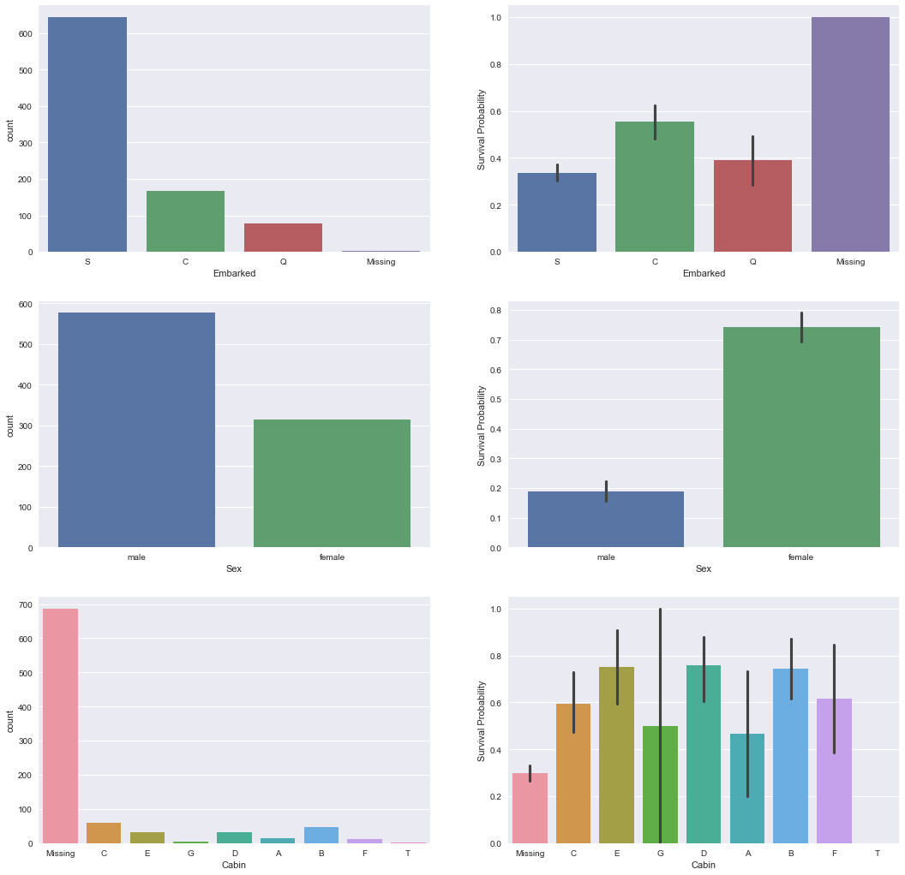
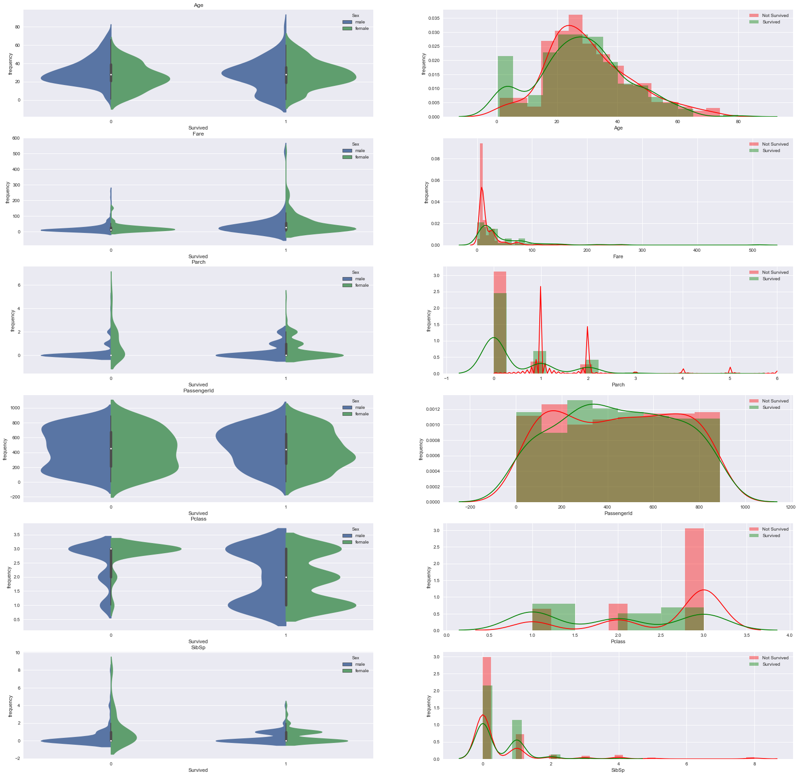
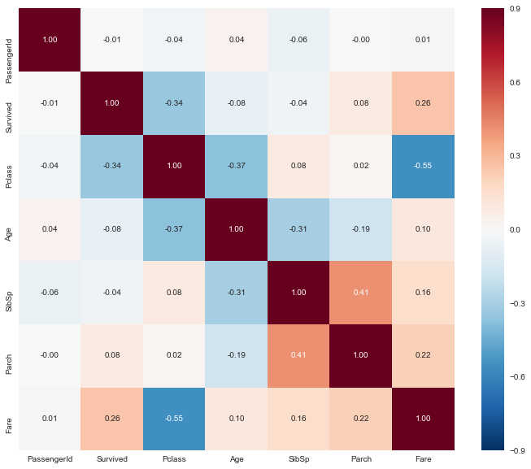
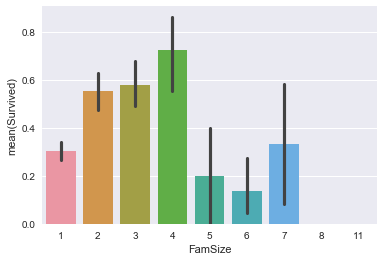
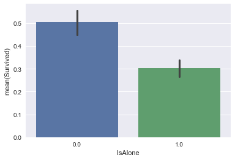
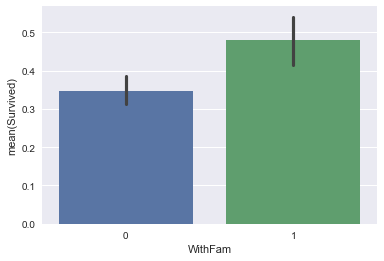
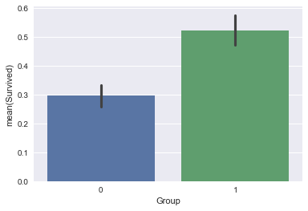

```python
# import some necessary libaries
import pandas as pd
import numpy as np
import matplotlib.pyplot as plt
import seaborn as sns
color = sns.color_palette()
sns.set_style('darkgrid')
%matplotlib inline

# ignore annoying warning (from sklearn and seaborn)
import warnings
def ignore_warn(*args, **kwargs):
    pass
warnings.warn = ignore_warn 

from scipy import stats
from scipy.stats import norm, skew
```


```python
# import data
train = pd.read_csv("F:\\Python_data_set\\titanic\\train.csv")
test  = pd.read_csv("F:\\Python_data_set\\titanic\\test.csv")

print("train contains: {}".format(train.shape))
print("test contains: {}".format(test.shape))
```

    train contains: (891, 12)
    test contains: (418, 11)
    


```python
train.head(10)
```


<div>
<style>
    .dataframe thead tr:only-child th {
        text-align: right;
    }

    .dataframe thead th {
        text-align: left;
    }

    .dataframe tbody tr th {
        vertical-align: top;
    }
</style>
<table border="1" class="dataframe">
  <thead>
    <tr style="text-align: right;">
      <th></th>
      <th>PassengerId</th>
      <th>Survived</th>
      <th>Pclass</th>
      <th>Name</th>
      <th>Sex</th>
      <th>Age</th>
      <th>SibSp</th>
      <th>Parch</th>
      <th>Ticket</th>
      <th>Fare</th>
      <th>Cabin</th>
      <th>Embarked</th>
    </tr>
  </thead>
  <tbody>
    <tr>
      <th>0</th>
      <td>1</td>
      <td>0</td>
      <td>3</td>
      <td>Braund, Mr. Owen Harris</td>
      <td>male</td>
      <td>22.0</td>
      <td>1</td>
      <td>0</td>
      <td>A/5 21171</td>
      <td>7.2500</td>
      <td>NaN</td>
      <td>S</td>
    </tr>
    <tr>
      <th>1</th>
      <td>2</td>
      <td>1</td>
      <td>1</td>
      <td>Cumings, Mrs. John Bradley (Florence Briggs Th...</td>
      <td>female</td>
      <td>38.0</td>
      <td>1</td>
      <td>0</td>
      <td>PC 17599</td>
      <td>71.2833</td>
      <td>C85</td>
      <td>C</td>
    </tr>
    <tr>
      <th>2</th>
      <td>3</td>
      <td>1</td>
      <td>3</td>
      <td>Heikkinen, Miss. Laina</td>
      <td>female</td>
      <td>26.0</td>
      <td>0</td>
      <td>0</td>
      <td>STON/O2. 3101282</td>
      <td>7.9250</td>
      <td>NaN</td>
      <td>S</td>
    </tr>
    <tr>
      <th>3</th>
      <td>4</td>
      <td>1</td>
      <td>1</td>
      <td>Futrelle, Mrs. Jacques Heath (Lily May Peel)</td>
      <td>female</td>
      <td>35.0</td>
      <td>1</td>
      <td>0</td>
      <td>113803</td>
      <td>53.1000</td>
      <td>C123</td>
      <td>S</td>
    </tr>
    <tr>
      <th>4</th>
      <td>5</td>
      <td>0</td>
      <td>3</td>
      <td>Allen, Mr. William Henry</td>
      <td>male</td>
      <td>35.0</td>
      <td>0</td>
      <td>0</td>
      <td>373450</td>
      <td>8.0500</td>
      <td>NaN</td>
      <td>S</td>
    </tr>
    <tr>
      <th>5</th>
      <td>6</td>
      <td>0</td>
      <td>3</td>
      <td>Moran, Mr. James</td>
      <td>male</td>
      <td>NaN</td>
      <td>0</td>
      <td>0</td>
      <td>330877</td>
      <td>8.4583</td>
      <td>NaN</td>
      <td>Q</td>
    </tr>
    <tr>
      <th>6</th>
      <td>7</td>
      <td>0</td>
      <td>1</td>
      <td>McCarthy, Mr. Timothy J</td>
      <td>male</td>
      <td>54.0</td>
      <td>0</td>
      <td>0</td>
      <td>17463</td>
      <td>51.8625</td>
      <td>E46</td>
      <td>S</td>
    </tr>
    <tr>
      <th>7</th>
      <td>8</td>
      <td>0</td>
      <td>3</td>
      <td>Palsson, Master. Gosta Leonard</td>
      <td>male</td>
      <td>2.0</td>
      <td>3</td>
      <td>1</td>
      <td>349909</td>
      <td>21.0750</td>
      <td>NaN</td>
      <td>S</td>
    </tr>
    <tr>
      <th>8</th>
      <td>9</td>
      <td>1</td>
      <td>3</td>
      <td>Johnson, Mrs. Oscar W (Elisabeth Vilhelmina Berg)</td>
      <td>female</td>
      <td>27.0</td>
      <td>0</td>
      <td>2</td>
      <td>347742</td>
      <td>11.1333</td>
      <td>NaN</td>
      <td>S</td>
    </tr>
    <tr>
      <th>9</th>
      <td>10</td>
      <td>1</td>
      <td>2</td>
      <td>Nasser, Mrs. Nicholas (Adele Achem)</td>
      <td>female</td>
      <td>14.0</td>
      <td>1</td>
      <td>0</td>
      <td>237736</td>
      <td>30.0708</td>
      <td>NaN</td>
      <td>C</td>
    </tr>
  </tbody>
</table>
</div>


```python
test.head(5)
```


<div>
<style>
    .dataframe thead tr:only-child th {
        text-align: right;
    }

    .dataframe thead th {
        text-align: left;
    }

    .dataframe tbody tr th {
        vertical-align: top;
    }
</style>
<table border="1" class="dataframe">
  <thead>
    <tr style="text-align: right;">
      <th></th>
      <th>PassengerId</th>
      <th>Pclass</th>
      <th>Name</th>
      <th>Sex</th>
      <th>Age</th>
      <th>SibSp</th>
      <th>Parch</th>
      <th>Ticket</th>
      <th>Fare</th>
      <th>Cabin</th>
      <th>Embarked</th>
    </tr>
  </thead>
  <tbody>
    <tr>
      <th>0</th>
      <td>892</td>
      <td>3</td>
      <td>Kelly, Mr. James</td>
      <td>male</td>
      <td>34.5</td>
      <td>0</td>
      <td>0</td>
      <td>330911</td>
      <td>7.8292</td>
      <td>NaN</td>
      <td>Q</td>
    </tr>
    <tr>
      <th>1</th>
      <td>893</td>
      <td>3</td>
      <td>Wilkes, Mrs. James (Ellen Needs)</td>
      <td>female</td>
      <td>47.0</td>
      <td>1</td>
      <td>0</td>
      <td>363272</td>
      <td>7.0000</td>
      <td>NaN</td>
      <td>S</td>
    </tr>
    <tr>
      <th>2</th>
      <td>894</td>
      <td>2</td>
      <td>Myles, Mr. Thomas Francis</td>
      <td>male</td>
      <td>62.0</td>
      <td>0</td>
      <td>0</td>
      <td>240276</td>
      <td>9.6875</td>
      <td>NaN</td>
      <td>Q</td>
    </tr>
    <tr>
      <th>3</th>
      <td>895</td>
      <td>3</td>
      <td>Wirz, Mr. Albert</td>
      <td>male</td>
      <td>27.0</td>
      <td>0</td>
      <td>0</td>
      <td>315154</td>
      <td>8.6625</td>
      <td>NaN</td>
      <td>S</td>
    </tr>
    <tr>
      <th>4</th>
      <td>896</td>
      <td>3</td>
      <td>Hirvonen, Mrs. Alexander (Helga E Lindqvist)</td>
      <td>female</td>
      <td>22.0</td>
      <td>1</td>
      <td>1</td>
      <td>3101298</td>
      <td>12.2875</td>
      <td>NaN</td>
      <td>S</td>
    </tr>
  </tbody>
</table>
</div>


PassengerId 

Pclass => class of passenger 1> 2> 3

Name 

Sex 

Age 

SibSp => number of cousins

Parch => number of parent & child

Ticket => ticket info

Fare 

Cabin

Embarked => habour that getting aboard

# Data Exploration

Distinguish numeric and categorical features

Visualizing distribution and correlation


```python
features = pd.concat([train, test]).reset_index(drop=True)
features.drop("Survived",axis=1,inplace=True)

numeric_feats = features.dtypes[features.dtypes!="object"].index
categorical_feats = features.dtypes[features.dtypes=="object"].index

print("all data contains: {}".format(features.shape))
print("numeric_feats are: {}".format(numeric_feats))
print("categorical_feats are: {}".format(categorical_feats))
```

    all data contains: (1309, 11)
    numeric_feats are: Index(['Age', 'Fare', 'Parch', 'PassengerId', 'Pclass', 'SibSp'], dtype='object')
    categorical_feats are: Index(['Cabin', 'Embarked', 'Name', 'Sex', 'Ticket'], dtype='object')
    

## categorical features distribution

### cabin&ticket distribution
cabin& ticket got too much unique values, we calssified them by using new rules


```python
train[["Cabin","Ticket"]].describe()
```


<div>
<style>
    .dataframe thead tr:only-child th {
        text-align: right;
    }

    .dataframe thead th {
        text-align: left;
    }

    .dataframe tbody tr th {
        vertical-align: top;
    }
</style>
<table border="1" class="dataframe">
  <thead>
    <tr style="text-align: right;">
      <th></th>
      <th>Cabin</th>
      <th>Ticket</th>
    </tr>
  </thead>
  <tbody>
    <tr>
      <th>count</th>
      <td>204</td>
      <td>891</td>
    </tr>
    <tr>
      <th>unique</th>
      <td>147</td>
      <td>681</td>
    </tr>
    <tr>
      <th>top</th>
      <td>C23 C25 C27</td>
      <td>1601</td>
    </tr>
    <tr>
      <th>freq</th>
      <td>4</td>
      <td>7</td>
    </tr>
  </tbody>
</table>
</div>


```python
train["Cabin"][train["Cabin"].notnull()].head()
```


    1      C85
    3     C123
    6      E46
    10      G6
    11    C103
    Name: Cabin, dtype: object


```python
#train["Ticket"][train["Ticket"].notnull()].head()
```

### cabin by using first letter #& ticket by using prefix


```python
train["Cabin"] = train["Cabin"].str[0]

#Ticket = []
#for i in list(train["Ticket"]):
#    if not i.isdigit():
#        Ticket.append(i.replace(".","").replace("/","").strip().split(" ")[0])
#    else:
#        Ticket.append("Num")
#train["Ticket"] = Ticket

train.Cabin.value_counts()
```


    C    59
    B    47
    D    33
    E    32
    A    15
    F    13
    G     4
    T     1
    Name: Cabin, dtype: int64


### Visualization
Temporally fill NA with Missing

Viewing whether ther're some categorical features linear to the survival probability


```python
feats = ["Embarked","Sex","Cabin"]
train_plt = train.copy()

plt.figure(figsize=(18,18))
for i,c in enumerate(feats):
    train_plt[feats] = train_plt[feats].fillna("Missing")
    plt.subplot(len(feats),2,i*2+1) 
    sns.countplot(train_plt[c])
    
    plt.subplot(len(feats),2,i*2+2)
    sns.barplot(y="Survived",x=c,data=train_plt)
    plt.ylabel("Survival Probability")
```





## numeric features distribution

Viewing whether there are some bizzarre relationship between numeric features and the label


```python
plt.figure(figsize=(30,30))

for i,c in enumerate(numeric_feats):
    plt.subplot(len(numeric_feats),2,i*2+1)
    sns.violinplot(train_plt["Survived"],train_plt[c],hue=train["Sex"],split=True)
    plt.ylabel("frequency")
    plt.title(numeric_feats[i])
    
    plt.subplot(len(numeric_feats),2,i*2+2)
    sns.distplot(train_plt[c][(train_plt["Survived"]==0) & (train_plt[c].notnull())],color="Red")
    sns.distplot(train_plt[c][(train_plt["Survived"]==1) & (train_plt[c].notnull())],color="Green")                          
    plt.ylabel("frequency")
    plt.legend(["Not Survived","Survived"])
```





## data correlation 


```python
plt.figure(figsize=(12,10))
g = sns.heatmap(train.corr(),vmax =0.9,square=False,annot=True,fmt=".2f")
```





# Data Preprocessing

## outlier 

### detect outliers


```python
def detect_outlier(df,numeric_feats,n):
    outlier_ind = []
    for col in numeric_feats:
        Q1 = np.percentile(df[col],25)
        Q3 = np.percentile(df[col],75)
        IQR = Q3 - Q1
        outlier_limit = 1.5*IQR
        outlier_list  = df[(df[col]<(Q1-outlier_limit))|
                            (df[col]>(Q3+outlier_limit))].index
        outlier_ind.extend(outlier_list)
    # select samples containing more than n outliers
    outlier_ind = pd.Series(outlier_ind)
    outlier_ind_count  = outlier_ind.value_counts()
    ourlier_drop = outlier_ind_count[outlier_ind_count.values> n].index
    return ourlier_drop

ourlier_drop =  detect_outlier(train,["Age","Fare","SibSp","Parch"],2)
```

### delete outliers


```python
train = train.drop(ourlier_drop,axis=0).reset_index(drop=True)
```

## update joint data after delete outliers and the classified cabin #&ticket


```python
features = pd.concat([train, test]).reset_index(drop=True)
features.drop("Survived",axis=1,inplace=True)

feats2 = ["Cabin","Ticket"]

features["Cabin"] = features["Cabin"].str[0]

#Ticket = []
#for i in list(features["Ticket"]):
#    if not i.isdigit():
#        Ticket.append(i.replace(".","").replace("/","").strip().split(" ")[0])
#    else:
#        Ticket.append("Num")
#features["Ticket"] = Ticket
```

## extract title from name


```python
features["Title"] = features.Name.str.extract("(\w+)\.")
features["Title"].value_counts()
```


    Mr          753
    Miss        255
    Mrs         197
    Master       60
    Rev           8
    Dr            8
    Col           4
    Ms            2
    Mlle          2
    Major         2
    Capt          1
    Dona          1
    Lady          1
    Don           1
    Sir           1
    Mme           1
    Countess      1
    Jonkheer      1
    Name: Title, dtype: int64


```python
pd.crosstab(features["Title"],features["Sex"]).T
```


<div>
<style>
    .dataframe thead tr:only-child th {
        text-align: right;
    }

    .dataframe thead th {
        text-align: left;
    }

    .dataframe tbody tr th {
        vertical-align: top;
    }
</style>
<table border="1" class="dataframe">
  <thead>
    <tr style="text-align: right;">
      <th>Title</th>
      <th>Capt</th>
      <th>Col</th>
      <th>Countess</th>
      <th>Don</th>
      <th>Dona</th>
      <th>Dr</th>
      <th>Jonkheer</th>
      <th>Lady</th>
      <th>Major</th>
      <th>Master</th>
      <th>Miss</th>
      <th>Mlle</th>
      <th>Mme</th>
      <th>Mr</th>
      <th>Mrs</th>
      <th>Ms</th>
      <th>Rev</th>
      <th>Sir</th>
    </tr>
    <tr>
      <th>Sex</th>
      <th></th>
      <th></th>
      <th></th>
      <th></th>
      <th></th>
      <th></th>
      <th></th>
      <th></th>
      <th></th>
      <th></th>
      <th></th>
      <th></th>
      <th></th>
      <th></th>
      <th></th>
      <th></th>
      <th></th>
      <th></th>
    </tr>
  </thead>
  <tbody>
    <tr>
      <th>female</th>
      <td>0</td>
      <td>0</td>
      <td>1</td>
      <td>0</td>
      <td>1</td>
      <td>1</td>
      <td>0</td>
      <td>1</td>
      <td>0</td>
      <td>0</td>
      <td>255</td>
      <td>2</td>
      <td>1</td>
      <td>0</td>
      <td>197</td>
      <td>2</td>
      <td>0</td>
      <td>0</td>
    </tr>
    <tr>
      <th>male</th>
      <td>1</td>
      <td>4</td>
      <td>0</td>
      <td>1</td>
      <td>0</td>
      <td>7</td>
      <td>1</td>
      <td>0</td>
      <td>2</td>
      <td>60</td>
      <td>0</td>
      <td>0</td>
      <td>0</td>
      <td>753</td>
      <td>0</td>
      <td>0</td>
      <td>8</td>
      <td>1</td>
    </tr>
  </tbody>
</table>
</div>


```python
features["Title"] = features["Title"].replace(list(features["Title"].value_counts()[4:].index),"Rare")
features["Title"].value_counts()
```


    Mr        753
    Miss      255
    Mrs       197
    Master     60
    Rare       34
    Name: Title, dtype: int64


## missing data


```python
print(features.shape)
features.isnull().sum()[features.isnull().sum()>0].sort_values(ascending=False)
```

    (1299, 12)
    


    Cabin       1007
    Age          256
    Embarked       2
    Fare           1
    dtype: int64


Cabin: has lost too much data, we probabilly need to give it a new category


```python
features["Cabin"].fillna("X",inplace=True)
```

Fare : strong connection with Pclass, use mediean of same Pclass's Fare


```python
features["Fare"] = features.groupby("Pclass")["Fare"].transform(
    lambda x: x.fillna(x.median()))
```

Embarked : using mode


```python
features["Embarked"].fillna(features["Embarked"].mode()[0],inplace=True)
```

Age is hard to tell, we can buld a model for predicting it by using other features


```python
#age_nan_index = list(features["Age"][features["Age"].isnull()].index)
#for i in age_nan_index:
#    age_med = features["Age"].median()
#    age_pred =  features["Age"][(features["SibSp"]==features.iloc[i]["SibSp"])&
#                                (features["Parch"]==features.iloc[i]["Parch"])&
#                                (features["Pclass"]==features.iloc[i]["Pclass"])].median()
#    if not np.isnan(age_pred):
#        features["Age"].iloc[i]=age_pred
#    else:
#        features["Age"].iloc[i]=age_med
```


```python
from sklearn.model_selection import KFold, cross_val_score, train_test_split
from sklearn.metrics import mean_squared_error
from sklearn.model_selection import GridSearchCV 

def pred_age(data,model,param):
    
    train = data[data["Age"].notnull()]
    test  = data[data["Age"].isnull()]
    
    Xtrain = train.drop("Age",axis=1)
    Ytrain = train["Age"]
    test   = test.drop("Age",axis=1)
    
    n_folds=10
    kf = KFold(n_folds, shuffle=True, random_state=42).get_n_splits(Xtrain)
    models = GridSearchCV(model,param,scoring="neg_mean_squared_error",cv=kf)
    models.fit(Xtrain,Ytrain)
        
    data.loc[data["Age"].isnull(),"Age"] = models.best_estimator_.predict(test)
      
    return data,models.best_params_,models.best_score_
```

check whether there is no missing value except age


```python
features.isnull().sum()[features.isnull().sum()>0].sort_values(ascending=False)
```


    Age    256
    dtype: int64


# Feature Engineering

## add feature

FamSize: crate Famliy size to see if it is corralete to survival


```python
train_plt["FamSize"]=train_plt["SibSp"]+train_plt["Parch"]+1
sns.barplot(y="Survived",x="FamSize",data=train_plt)
```


    <matplotlib.axes._subplots.AxesSubplot at 0x1dc854f0400>





update to all data


```python
features["FamSize"]=features["SibSp"]+features["Parch"]+1
```

IsAlone: from the graph we can see that someone who has no family only possess 0.3 survival rate, so further we build IsAlone that indicates whether they are alone


```python
train_plt.loc[train_plt["FamSize"]==1,"IsAlone"] = 1
train_plt.loc[train_plt["FamSize"]>1,"IsAlone"] = 0
sns.barplot(y="Survived",x="IsAlone",data=train_plt)
```


    <matplotlib.axes._subplots.AxesSubplot at 0x1dc86866780>





update to all data


```python
features.loc[features["FamSize"]==1,"IsAlone"] = 1
features.loc[features["FamSize"]>1,"IsAlone"] = 0
```

WithFam: indicates that families were getting aboard together, by using last name and fare to groupby, coz families seems paying the same fare for them all


```python
## extract last name
train_plt["LastName"] = train_plt["Name"].map(lambda s: str.split(s,",")[0])

## see if there is another feature that can help to identify families
NameGroup = train_plt.groupby(["LastName"])
NameGroup.size()[NameGroup.size()> 1].index
```


    Index(['Abbott', 'Abelson', 'Ali', 'Allen', 'Allison', 'Andersson', 'Andrews',
           'Arnold-Franchi', 'Asplund', 'Attalah',
           ...
           'Turpin', 'Van Impe', 'Vander Planke', 'Webber', 'West', 'White',
           'Wick', 'Williams', 'Yasbeck', 'Zabour'],
          dtype='object', name='LastName', length=133)


```python
NameGroup.get_group("Andersson").head()
```


<div>
<style>
    .dataframe thead tr:only-child th {
        text-align: right;
    }

    .dataframe thead th {
        text-align: left;
    }

    .dataframe tbody tr th {
        vertical-align: top;
    }
</style>
<table border="1" class="dataframe">
  <thead>
    <tr style="text-align: right;">
      <th></th>
      <th>PassengerId</th>
      <th>Survived</th>
      <th>Pclass</th>
      <th>Name</th>
      <th>Sex</th>
      <th>Age</th>
      <th>SibSp</th>
      <th>Parch</th>
      <th>Ticket</th>
      <th>Fare</th>
      <th>Cabin</th>
      <th>Embarked</th>
      <th>FamSize</th>
      <th>IsAlone</th>
      <th>LastName</th>
    </tr>
  </thead>
  <tbody>
    <tr>
      <th>13</th>
      <td>14</td>
      <td>0</td>
      <td>3</td>
      <td>Andersson, Mr. Anders Johan</td>
      <td>male</td>
      <td>39.0</td>
      <td>1</td>
      <td>5</td>
      <td>347082</td>
      <td>31.2750</td>
      <td>Missing</td>
      <td>S</td>
      <td>7</td>
      <td>0.0</td>
      <td>Andersson</td>
    </tr>
    <tr>
      <th>68</th>
      <td>69</td>
      <td>1</td>
      <td>3</td>
      <td>Andersson, Miss. Erna Alexandra</td>
      <td>female</td>
      <td>17.0</td>
      <td>4</td>
      <td>2</td>
      <td>3101281</td>
      <td>7.9250</td>
      <td>Missing</td>
      <td>S</td>
      <td>7</td>
      <td>0.0</td>
      <td>Andersson</td>
    </tr>
    <tr>
      <th>119</th>
      <td>120</td>
      <td>0</td>
      <td>3</td>
      <td>Andersson, Miss. Ellis Anna Maria</td>
      <td>female</td>
      <td>2.0</td>
      <td>4</td>
      <td>2</td>
      <td>347082</td>
      <td>31.2750</td>
      <td>Missing</td>
      <td>S</td>
      <td>7</td>
      <td>0.0</td>
      <td>Andersson</td>
    </tr>
    <tr>
      <th>146</th>
      <td>147</td>
      <td>1</td>
      <td>3</td>
      <td>Andersson, Mr. August Edvard ("Wennerstrom")</td>
      <td>male</td>
      <td>27.0</td>
      <td>0</td>
      <td>0</td>
      <td>350043</td>
      <td>7.7958</td>
      <td>Missing</td>
      <td>S</td>
      <td>1</td>
      <td>1.0</td>
      <td>Andersson</td>
    </tr>
    <tr>
      <th>541</th>
      <td>542</td>
      <td>0</td>
      <td>3</td>
      <td>Andersson, Miss. Ingeborg Constanzia</td>
      <td>female</td>
      <td>9.0</td>
      <td>4</td>
      <td>2</td>
      <td>347082</td>
      <td>31.2750</td>
      <td>Missing</td>
      <td>S</td>
      <td>7</td>
      <td>0.0</td>
      <td>Andersson</td>
    </tr>
  </tbody>
</table>
</div>


```python
# train_plt_group_df saves observations shared with same LastName, Fare and FamSize
train_plt_fam = train_plt.groupby(["LastName","Fare","FamSize"])
train_plt_fam_df = train_plt_fam.size()[(train_plt_fam.size()> 1)]
train_plt_fam_df = pd.DataFrame(train_plt_fam_df.reset_index())

train_plt["WithFam"] = 0
train_plt.loc[(train_plt.LastName.map(lambda s: s in train_plt_fam_df.LastName.values))&
              (train_plt.Fare.map(lambda s: s in train_plt_fam_df.Fare.values))&
              (train_plt.FamSize>1),"WithFam"] = 1
sns.barplot(y="Survived",x="WithFam",data=train_plt)
```


    <matplotlib.axes._subplots.AxesSubplot at 0x1dc8650f828>





update to all data


```python
features["LastName"] = features["Name"].map(lambda s: str.split(s,",")[0])

features_fam = features.groupby(["LastName","Fare","FamSize"])
features_fam_df = features_fam.size()[(features_fam.size()> 1)]
features_fam_df = pd.DataFrame(features_fam_df.reset_index())

features["WithFam"] = 0
features.loc[(features.LastName.map(lambda s: s in features_fam_df.LastName.values))&
             (features.Fare.map(lambda s: s in features_fam_df.Fare.values))&
             (features.FamSize>1),"WithFam"] = 1
```

Group: indicates that man who gets aboard with friends or colleagues, by using ticket info and fare, coz group would have same ticket number


```python
Group = train_plt.groupby(["Ticket","Fare"])
Group.size()[Group.size()> 1][:10]
```


    Ticket  Fare    
    110152  86.5000     3
    110413  79.6500     3
    110465  52.0000     2
    111361  57.9792     2
    113505  55.0000     2
    113572  80.0000     2
    113760  120.0000    4
    113776  66.6000     2
    113781  151.5500    4
    113789  52.0000     2
    dtype: int64


```python
Group_df = Group.size()[(Group.size()> 1)]
Group_df = pd.DataFrame(Group_df.reset_index())

train_plt["Group"] = 0
train_plt.loc[(train_plt.Ticket.map(lambda s: s in Group_df.Ticket.values))&
              (train_plt.Fare.map(lambda s: s in Group_df.Fare.values)),"Group"] = 1
sns.barplot(y="Survived",x="Group",data=train_plt)
```


    <matplotlib.axes._subplots.AxesSubplot at 0x1dc85671f28>





update to all data


```python
features_group = features.groupby(["Ticket","Fare"])
features_group_df = features_group.size()[(features_group.size()> 1)]
features_group_df = pd.DataFrame(features_group_df.reset_index())

features["Group"] = 0
features.loc[(features.Ticket.map(lambda s: s in features_group_df.Ticket.values))&
             (features.Fare.map(lambda s: s in features_group_df.Fare.values)),"Group"] = 1
```

## delete feature
delete useless features


```python
features.drop(["PassengerId","Name","Ticket"],axis=1,inplace=True)
```

## numeric2categorical
from observing numeric feautres disstribution


```python
features.Parch = features.Parch.astype(str)
features.SibSp = features.SibSp.astype(str)
features.Pclass = features.Pclass.astype(str)
features.FamSize = features.FamSize.astype(str)
```

## categorical2numeric
from observing categorical feautres distribution


```python
# label encoding
from sklearn.preprocessing import LabelEncoder

cols = ["Sex"]

# process columns, apply LabelEncoder to categorical features
for c in cols:
    lbl = LabelEncoder() 
    lbl.fit(list(features[c].values)) 
    features[c] = lbl.transform(list(features[c].values))

# shape        
print('Shape features: {}'.format(features.shape))
```

    Shape features: (1299, 14)
    

## skew features
normal distribution for features with high skewness by using boxcox1p


```python
# 5 making high skewness features to satisfy normal distribution by using boxcox
from scipy.stats import skew
from scipy.special import boxcox1p
numeric_feats = features.dtypes[features.dtypes != "object"].index

skewed_feats = features[numeric_feats].apply(lambda x: skew(x.dropna())) #compute skewness
print(skewed_feats)
skewed_feats = skewed_feats[abs(skewed_feats) > 0.75].index

lam=0.15
features[skewed_feats] = boxcox1p(features[skewed_feats],lam)
```

    Age        0.402936
    Fare       4.506337
    Sex       -0.606553
    IsAlone   -0.443133
    WithFam    0.667064
    Group      0.202727
    dtype: float64
    

## get dummy
OneHotEncoder


```python
# 6 OneHotEncoder
category_feats = features.dtypes[features.dtypes == "object"].index
features = pd.get_dummies(features,columns=category_feats)    
print(features.shape)
```

    (1299, 925)
    

## age modeling 


```python
from sklearn.linear_model import Lasso,Ridge
lasso = Lasso()
param = {"alpha": np.logspace(-5,0,100).round(5)}

features,param, score = pred_age(features,lasso,param)
print("rmse = {:.2f}, with param = {}".format(np.sqrt(-score),param))
```

    rmse = 10.76, with param = {'alpha': 0.0152}
    

## new train and test 


```python
train_features = features[:train.shape[0]]
test_features  = features[train.shape[0]:]
train_labels   = train["Survived"].values
```

## normalization

RobustScaler: robust to the outliers

StandardScaler: std


```python
from sklearn.preprocessing import RobustScaler,StandardScaler
RS = StandardScaler()
RS.fit(train_features)
train_features_scale = RS.transform(train_features)
test_features_scale = RS.transform(test_features)
```

# Modelling

## import lib


```python
from sklearn.linear_model import SGDClassifier,LogisticRegression
from sklearn.svm import SVC
from sklearn.ensemble import RandomForestClassifier
from sklearn.pipeline import make_pipeline
from sklearn.base import BaseEstimator, TransformerMixin, RegressorMixin, clone
from sklearn.model_selection import StratifiedShuffleSplit, cross_val_score
from sklearn.model_selection import GridSearchCV
import xgboost as xgb
import lightgbm as lgb
```

## cv coding


```python
from sklearn.model_selection import cross_val_score

#Validation function
def accuracy_cv(model):
    sss = StratifiedShuffleSplit(n_splits=5,test_size = 0.2,random_state=1)
    accuarcy_cv= cross_val_score(model, train_features_scale, train_labels, scoring="accuracy",cv = sss)
    return(accuarcy_cv)
```

## gridSearch coding


```python
def param_select(model,param):
    sss = StratifiedShuffleSplit(n_splits=5,test_size = 0.2, random_state=1)
    models = GridSearchCV(model,param,scoring="neg_mean_squared_error",cv=sss)
    models.fit(train_features_scale,train_labels)
    return models.best_estimator_,models.best_params_
```

## base models

### LogisticRegression


```python
param = {"C": np.logspace(-5,0,100).round(5),"max_iter":np.linspace(100,500,5)}
LR,best_param = param_select(LogisticRegression(),param)
print(best_param)
```

    {'C': 0.077429999999999999, 'max_iter': 100.0}
    


```python
LR = LogisticRegression(C =0.01918,max_iter=100, random_state=3)
```

### SVC


```python
param = {"C": np.logspace(-5,0,100).round(5)}
svc,best_param = param_select(SVC(random_state=3),param)
print(best_param)
```

    {'C': 1.0}
    


```python
svc = SVC(C =0.70548, random_state=3)
```

### SGDClassifier 


```python
param = {"alpha": np.logspace(-5,0,100).round(5),"l1_ratio":np.linspace(0.1,0.9,18)}
sgdc,best_param = param_select(SGDClassifier(loss='hinge', penalty='elasticnet'),param)
print(best_param)
```

    {'alpha': 0.086970000000000006, 'l1_ratio': 0.10000000000000001}
    


```python
sgdc = SGDClassifier(loss='hinge', penalty='elasticnet', alpha=0.01978, l1_ratio=0.42941)
```

### RandomForestClassifier 


```python
param = {"n_estimators":range(10,200,100), "min_samples_split":range(2,10,5),
         "min_samples_leaf":range(1,5,5), "max_depth":range(1,6,5)}
rfc,best_param = param_select(RandomForestClassifier(random_state=4),param)
print(best_param)
```

    {'max_depth': 1, 'min_samples_leaf': 1, 'min_samples_split': 2, 'n_estimators': 10}
    


```python
rfc = RandomForestClassifier(n_estimators=10, min_samples_split=2, min_samples_leaf=1, max_depth=1, random_state=4)
```

### XGBoost


```python
param = {"colsample_bytree": np.linspace(0.2,1,5), "gamma": np.logspace(-2,1,5),
         "learning_rate": np.logspace(-2,0,5), "max_depth": range(3,11,8),
         "n_estimators": range(10,200,50), "subsample": np.linspace(0.2,1,5)}
XGB,best_param = param_select(xgb.XGBClassifier(random_state=5),param)
print(best_param)
```

    {'colsample_bytree': 0.80000000000000004, 'gamma': 10.0, 'learning_rate': 1.0, 'max_depth': 3, 'n_estimators': 160, 'subsample': 0.60000000000000009}
    


```python
XGB = xgb.XGBClassifier(colsample_bytree=0.4, gamma=0.056234, 
                        learning_rate=0.316228, max_depth=3, 
                        n_estimators=110,subsample=0.6, random_state=5)
```

### LightGBM


```python
param = {"n_estimators":range(10,200,100), "min_samples_split":range(2,10,5),
         "min_samples_leaf":range(1,5,5), "max_depth":range(1,5,5)}
LGB,best_param = param_select(lgb.LGBMClassifier(),param)
print(best_param)
```

    {'max_depth': 1, 'min_samples_leaf': 1, 'min_samples_split': 2, 'n_estimators': 110}
    


```python
LGB = lgb.LGBMClassifier(n_estimators= 110, min_samples_split= 2,
                         min_samples_leaf= 1, max_depth= 1)
```

## base models scores


```python
score = accuracy_cv(LR)
print("\nLogisitciRegression score: {:.4f} +/- {:.4f}\n".format(score.mean(), score.std()))
# LogisitciRegression score: 0.8271 +/- 0.0177
```

    
    LogisitciRegression score: 0.8271 +/- 0.0184
    
    


```python
score = accuracy_cv(svc)
print("\nSVC score: {:.4f} +/- {:.4f}\n".format(score.mean(), score.std()))
# SVC score: 0.8169 +/- 0.0191
```

    
    SVC score: 0.7864 +/- 0.0140
    
    


```python
score = accuracy_cv(sgdc)
print("\nSGDClassifier score: {:.4f} +/- {:.4f}\n".format(score.mean(), score.std()))
# SGDClassifier score: 0.8373 +/- 0.0126
```

    
    SGDClassifier score: 0.8441 +/- 0.0116
    
    


```python
score = accuracy_cv(rfc)
print("\nRandomForestClassifier score: {:.4f} +/- {:.4f}\n".format(score.mean(), score.std()))
# RandomForestClassifier score: 0.7751 +/- 0.0324
```

    
    RandomForestClassifier score: 0.6294 +/- 0.0244
    
    


```python
score = accuracy_cv(XGB)
print("\nXGBoost score: {:.4f} +/- {:.4f}\n".format(score.mean(), score.std()))
# XGBoost score: 0.8497 +/- 0.0146
```

    
    XGBoost score: 0.8475 +/- 0.0107
    
    


```python
score = accuracy_cv(LGB)
print("\nlightGBM score: {:.4f} +/- {:.4f}\n".format(score.mean(), score.std()))
# lightGBM score: 0.8384 +/- 0.0132
```

    
    lightGBM score: 0.8282 +/- 0.0116
    
    

## Stacking models

### Stucked base models class


```python
class StuckingModels(BaseEstimator, RegressorMixin, TransformerMixin):
    def __init__(self,BaseModels,MetaModel):
        self.BaseModels = BaseModels
        self.MetaModel  = MetaModel
        
    def fit(self,x_data,y_data):
        self.BaseModels_ = [list() for x in self.BaseModels]
        self.MetaModel_  = clone(self.MetaModel)
        sss = StratifiedShuffleSplit(n_splits=5,test_size = 0.2, random_state=1)
        meta_fold = np.zeros((x_data.shape[0],len(self.BaseModels)))
        
        for i,model in enumerate(self.BaseModels):
            for train_index, test_index in sss.split(x_data,y_data):
                instance = clone(model)
                self.BaseModels_[i].append(instance)
                instance.fit(x_data[train_index],y_data[train_index])
                pred = instance.predict(x_data[test_index])
                meta_fold[test_index, i] = pred
                
        self.MetaModel_.fit(meta_fold,y_data) 
        return self
    
    def predict(self,x_data):
        meta_features = np.column_stack([
            np.column_stack([model.predict(x_data) for model in BaseModels]).mean(axis=1)
            for BaseModels in self.BaseModels_])
        return self.MetaModel_.predict(meta_features)
```

### Combine models class


```python
class CombineModels(BaseEstimator, RegressorMixin, TransformerMixin):
    def __init__(self, models):
        self.models = models
        
    # we define clones of the original models to fit the data in
    def fit(self, x_data, y_data):
        self.models_ = [clone(x) for x in self.models]
        # train cloned base models
        for model in self.models_:
            model.fit(x_data,y_data)
        return self
    
    # now we do the predictions for cloned models and average them
    def predict(self,x_data):
        predictions = np.column_stack([model.predict(x_data) for model in self.models_])
        temp = np.sum(predictions,axis=1)
        for i in temp:
            if temp>= len(self.models)/2:
                    predictions[i] = 1
            else:
                    predictions[i] = 0
        return predictions
```

### Stucked base models score


```python
StuckedModels =StuckingModels(BaseModels=(svc,sgdc,XGB,LGB),MetaModel=LR)
score = accuracy_cv(StuckedModels)
print(" Stucked base models score:{:.4f} +/- {:.4f}".format(score.mean(),score.std()))
# Stucked base models score:0.8395 +/- 0.0105
```

     Stucked base models score:0.8305 +/- 0.0171
    

# Prediction


```python
StuckedModels.fit(train_features_scale,train_labels)
pred = StuckedModels.predict(test_features_scale)
```


```python
filepath = "F:\\Python_data_set\\titanic\\"
submission = pd.DataFrame({"PassengerId":test.PassengerId,"Survived":pred})
submission.to_csv(filepath + "submission.csv",index=False)
```
